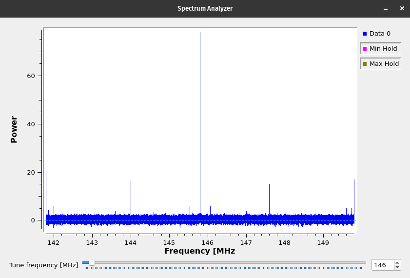
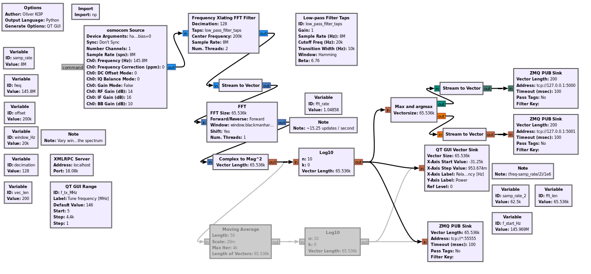
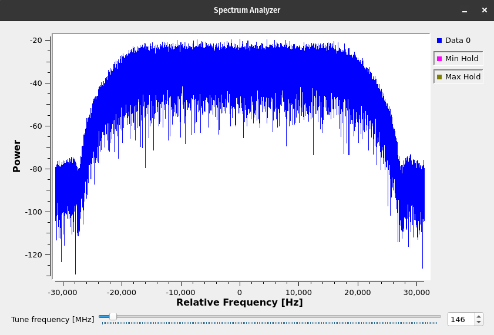

# HackRF Gnuradio Spectrum Analyzer

Use a HackRF (or other SDR) as a spectrum analyzer. This repository contains gnuradio flows and an iPython notebook to retrieve data from them.

## `hackrf_spectrum_analyzer.grc`

Sample an 8 MHz wide swathe of frequency.
 

## `hackrf_spectrum_analyzer-high_resolution.grc`

Capture a narrow portion of the spectrum with a high frequency resolution.

## `control_spectrum_analyzer.ipynb`

Control the spectrum parameters and read the spectrum from Python. If you want to control the spectrum parameters from Python, disable the `QT GUI Range` block that changes the value of `f_TX_MHz` and enable to variable block of the same name.